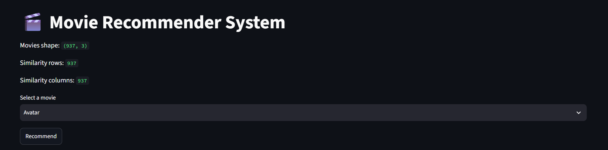
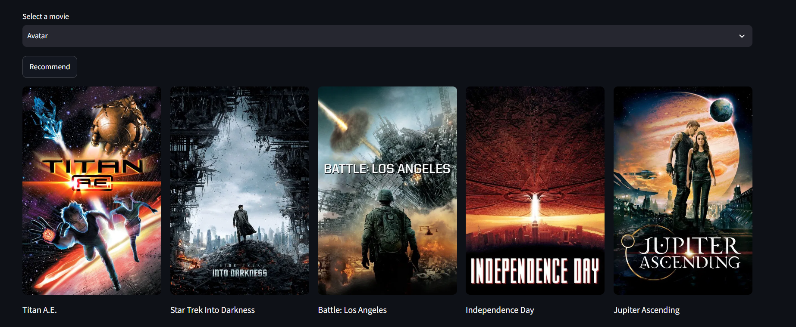

# 🎬 Movie Recommender System

A content-based Movie Recommendation System built using Python, Streamlit, and Machine Learning.

## 🚀 Features

- Recommend 5 similar movies
- Content-based filtering using cosine similarity
- Interactive Streamlit web interface
- Movie posters fetched using the TMDB API

## 🛠️ Technologies Used

- Python
- Streamlit
- Pandas
- Scikit-learn
- Pickle
- Requests
- TMDB API

## 📂 Project Structure

```
Movie-Recommender-System/
│── app.py
│── main.py
│── movie_dict.pkl
│── similarity.pkl
│── movies.pkl
│── requirements.txt
│── README.md
│── .gitignore
```

## ⚙️ Installation

Clone the repository

```bash
git clone https://github.com/Rohitt-001/Movie-Recommender-System.git
```

Go to the project folder

```bash
cd Movie-Recommender-System
```

Install dependencies

```bash
pip install -r requirements.txt
```

Run the application

```bash
streamlit run app.py
```

## 📷 Screenshots

### Home Page



### Recommendation Result



## 👨‍💻 Author

**Rohit Das**

B.Tech CSE | NIT Meghalaya

GitHub: https://github.com/Rohitt-001